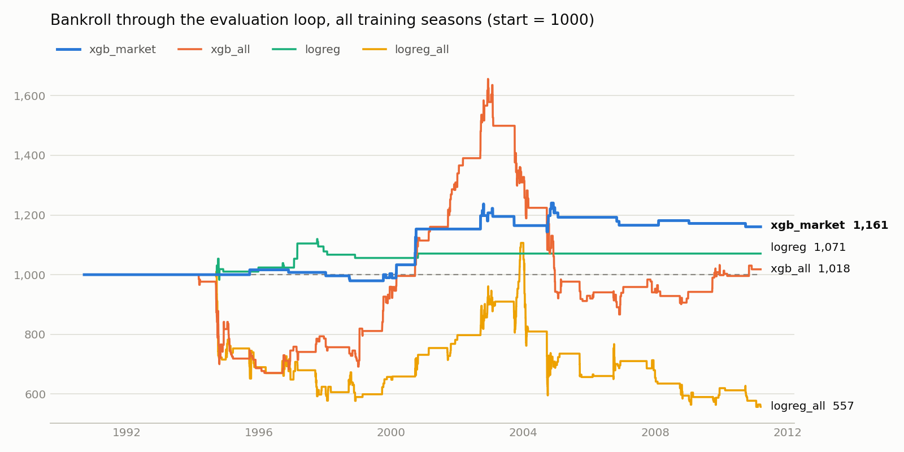

# Ice Hockey Betting Model — Qminers Quant Hackathon 2025

> **In short:** an ML betting agent for 20+ seasons of NHL games. Gradient boosting learns a
> correction on top of the bookmaker's own probabilities and beats the market's log-loss in
> season-by-season walk-forward validation. Over all training seasons it grows the bankroll by
> 16 %, while the variants that ignore the market lose money or swing wildly.

A betting agent for NHL-style ice hockey games, built for the
[Qminers Quant Hackathon 2025](http://hyperion.felk.cvut.cz/). Each day the agent sees the
day's results and the bookmaker's odds for upcoming games, estimates win probabilities and
decides how much of its bankroll to stake on each game.

The hard part is not predicting who wins, but finding the games where the bookmaker is
wrong by more than its built-in margin (~17 % overround in this data).

**Stack:** Python 3.12, pandas, NumPy, scikit-learn, XGBoost

## Approach

The whole model lives in [`src/model.py`](src/model.py). It is a single module because the
submission system only accepts one file. The maths behind each stage is written up in
[`docs/model_math.pdf`](docs/model_math.pdf). It has three stages:

**1. Online feature building (`FeatureBuilder`)**
Games are processed strictly in date order. Before a game updates any team state, its
pre-game feature vector is saved, so every training row contains only information that was
available when the bet would have been placed. Games played on the same day are recorded
first and applied afterwards, so they cannot leak into each other.

Features per game:
- **Market probability:** the bookmaker's odds with the margin removed (in log-odds)
- **Elo rating:** with home advantage, margin-of-victory scaling and regression to the
  mean between seasons
- **Poisson goal ratings:** online attack/defence strengths and the expected goal difference
- **Team form:** exponentially weighted averages at two speeds (~6 and ~25 games) of
  goals, shots, power-play goals, penalties and goalie save percentage
- **Schedule:** days of rest, back-to-back games, season win rate

Shots on goal are only recorded from 2009 onward, so I rebuilt them for every season from
opponent saves plus goals.

**2. Probability model (`OutcomeModel`)**
The model predicts P(home win | no draw). The default variant, `xgb_market`, is
gradient boosting that starts from the market's log-odds as its base margin. That way it
does not re-learn what the bookmaker already knows, only learns a correction on top of it.
It is refit every 150 new games on a rolling window of the last 8 seasons.

**3. Staking (`KellyStaker`)**
Fractional Kelly (25 %) on the single best outcome of a game, only if the expected return
is at least 5 %. Each bet is capped at 5 % of the bankroll and the daily total at 20 %.

## Validation

[`src/validate.py`](src/validate.py) runs a season-by-season walk-forward test: for each
season, every variant is trained only on earlier seasons and then compared with the
bookmaker on log-loss. A model that cannot beat the market's log-loss has no real edge,
however good its accuracy looks.

| Variant | Log-loss gain vs market (all / 2002+) | Bets at ≥5 % edge | Flat-stake ROI | Final bankroll, all seasons | Final bankroll, 2007–2011 |
|---|---|---:|---:|---:|---:|
| `logreg` (market + Elo + goals) | −0.0008 / −0.0005 | 24 | −17.9 % | 1070.74 | 1000.00 |
| `logreg_all` (all features) | −0.0015 / −0.0044 | 333 | +0.8 % | 556.99 | 691.23 |
| `xgb_all` | +0.0012 / −0.0016 | 209 | +17.6 % | 1017.95 | 941.59 |
| **`xgb_market`** (default) | **+0.0023 / +0.0005** | 33 | +26.5 % | **1160.55** | 987.83 |

Final bankroll starts from 1000 and comes from the full evaluation loop
([`src/evaluate.py`](src/evaluate.py)). The 2007–2011 column mimics the real submission
setup: all earlier games are given as history and betting starts only in 2007.

<picture>
  <source media="(prefers-color-scheme: dark)" srcset="docs/bankroll_dark.png">
  
</picture>

`xgb_all` peaks near 1650 and then gives most of it back. `xgb_market` grows more slowly but
never falls far below the starting bankroll.

[`src/experiments.py`](src/experiments.py) holds the experiments behind the design choices:
which seasons to train on, shrinking the model's log-odds toward the market's, checking
whether the predicted edge matches the realised return, and testing whether each feature
adds anything beyond the market price. Settings were chosen on the 2005–06 seasons only;
the 2007–10 seasons were kept as a holdout and checked once at the end.

**Takeaways**
- Only the variants that start from the market's prediction beat it on log-loss at all,
  and the margin is small. The bookmaker is a very strong baseline.
- More features made logistic regression *worse*: it overfits even with strong
  regularisation (`logreg_all` lost ~45 % of its bankroll).
- `xgb_market` was profitable over the full history but roughly broke even on the most
  recent seasons, where it correctly bet very rarely. The ROI figures come from few bets
  and are not statistically significant. The honest conclusion is that the edge over this
  market is thin.
- Beating the market on log-loss is necessary but not enough. `logreg_compact` (the market
  plus the five features that helped most in the experiments) beats the market's log-loss on
  later seasons too, yet bets more often and ends at 924 (895 from 2007).

## What I'd do next

- Size stakes by how uncertain the model is about its edge, not only by the edge itself.
- Model draws explicitly instead of predicting P(home win | no draw) and treating draws as
  losses.
- Test on more seasons: with few bets per season, the ROI estimates are still too noisy to
  separate a small real edge from luck.

## Running it

```bash
# with uv
uv sync && source .venv/bin/activate
# or with conda
conda env create -f qqh-2025-env.yml && conda activate qqh-2025

cd src
python validate.py                              # walk-forward comparison of all variants
python evaluate.py                              # default variant on all training seasons
python evaluate.py xgb_all --from-season 2007   # a chosen variant on the last 4 seasons
python experiments.py                           # design experiments (dev / holdout seasons)
python plot_bankroll.py                         # regenerate the bankroll chart in docs/
```

## Repository structure

| Path | Description | Author |
|---|---|---|
| [`src/model.py`](src/model.py) | Features, probability models and staking | me |
| [`src/validate.py`](src/validate.py) | Walk-forward validation against the market | me |
| [`src/experiments.py`](src/experiments.py) | Experiments behind the design choices, with dev / holdout seasons | me |
| [`src/plot_bankroll.py`](src/plot_bankroll.py) | Bankroll chart for the README | me |
| [`docs/model_math.pdf`](docs/model_math.pdf) | Maths of the features, models and staking | me |
| [`src/evaluate.py`](src/evaluate.py) | Runs a variant through the evaluation loop (extended with variant and season options) | organisers, extended by me |
| [`src/environment.py`](src/environment.py) | Evaluation loop used by the submission system | organisers |
| [`data/games.csv`](data/games.csv) | Training data: games from the 1989/90–2010/11 seasons | organisers |
| [`problem_info_en.md`](problem_info_en.md) | Full problem statement and data description (my English translation of [`problem_info.md`](problem_info.md)) | organisers |

The competition was scored on hidden data from the 2011/12–2014/15 seasons, with 1 CPU
and 5 GB RAM available.

## License

[MIT](LICENSE), covering my own code. The evaluation environment, data and problem
statement belong to the hackathon organisers.
